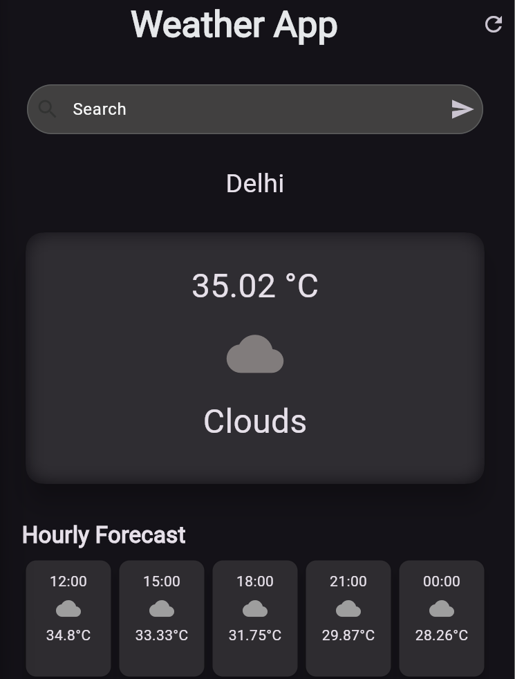
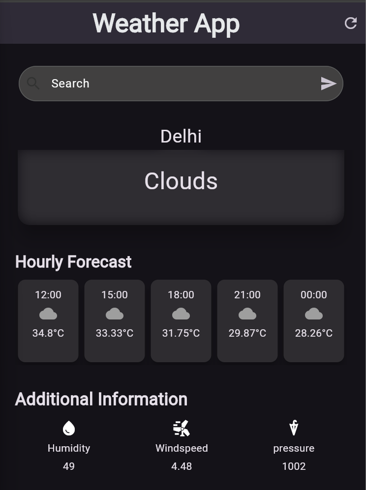

# 🌤️ Weather App

A beautiful and responsive weather application built with Flutter that provides real-time weather information with an elegant user interface.

  
  

## ✨ Features

- **🌡️ Current Weather** - Real-time temperature and weather conditions
- **📅 Hourly Forecast** - 24-hour weather predictions with time-based data
- **🔍 City Search** - Search for weather in any city worldwide
- **📊 Weather Details** - Comprehensive metrics including:
  - Humidity levels
  - Wind speed
  - Atmospheric pressure
- **🎨 Beautiful UI** - Clean Material Design with weather-appropriate colors
- **🔄 Auto-Refresh** - Pull-to-refresh functionality
- **📱 Responsive Design** - Optimized for mobile devices

## 🚀 Getting Started

### Prerequisites

- Flutter SDK (version 3.19.0 or higher)
- Dart (version 3.3.0 or higher)
- OpenWeatherMap API key

